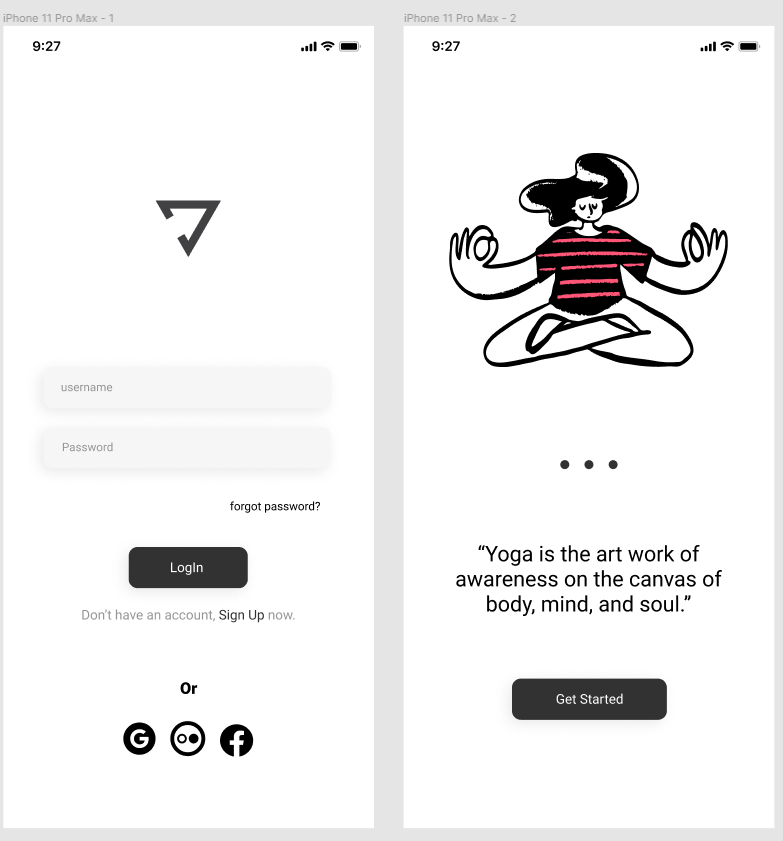

# Yoga Interface

<!---Esses são exemplos. Veja https://shields.io para outras pessoas ou para personalizar este conjunto de escudos. Você pode querer incluir dependências, status do projeto e informações de licença aqui--->

> Resultado do projeto Yoga.

### Ajustes e melhorias

O projeto ainda está em desenvolvimento e as próximas atualizações serão voltadas nas seguintes tarefas:

- [x] Criação do HTML
- [x] Criasção do  CSS
- [ ] Atualização do layout

## 🤝 Colaboradores

Agradecemos às seguintes pessoas que contribuíram para este projeto:

<table>
  <tr>
    <td align="center">
      <a href="https://www.linkedin.com/in/luiz-carlos-nogueira-silva-944a896b/">
         
        
          <b>Luiz Nogueira</b>
        
      </a>
    </td>
   
    
  </tr>
</table>

